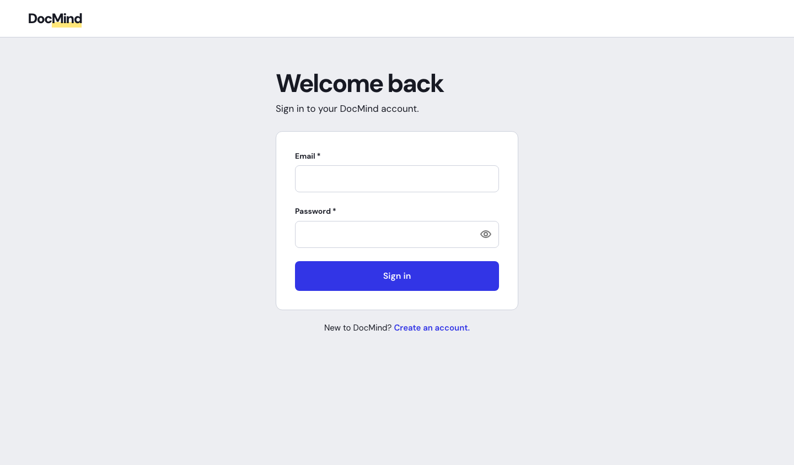
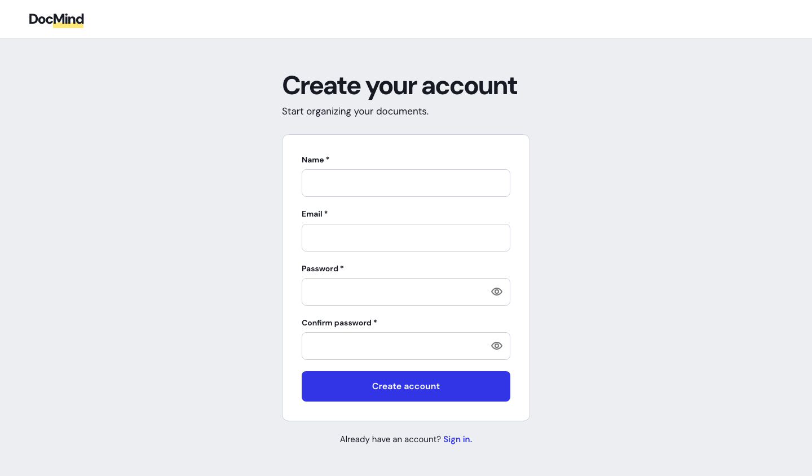
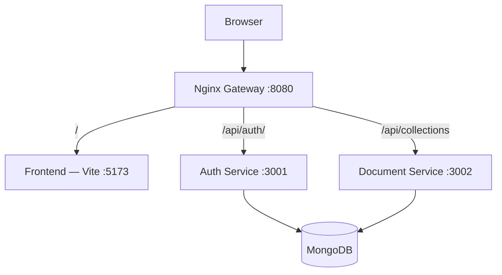

# DocMind

**Organize your documents. Ask questions. Find answers with context.**
# DocMind

**Organize your documents. Ask questions. Find answers with context.**

DocMind is a full-stack application being built to help users organize documents into collections and ask questions about their contents using Retrieval-Augmented Generation (RAG).

The authentication system, collections API, and containerized development environment are implemented. Document uploads and collection chat are planned.

## Features

### Implemented

- Collection creation, listing, editing, and deletion with per-user ownership checks.
- User registration and login.
- Password hashing with bcrypt.
- JWT access tokens and rotating refresh tokens.
- Refresh tokens stored in HttpOnly cookies.
- Session restoration after page reload.
- Protected frontend routes, including the collections dashboard at `/collections`.
- Cross-tab authentication synchronization.
- Responsive authentication interfaces built with Material UI.
- Docker Compose development environment.
- Nginx gateway for frontend and API routing.

### Planned

- Upload, list, and delete documents.
- Extract and split document text into chunks.
- Generate embeddings and retrieve relevant content.
- Ask questions within a selected collection.
- Display source references alongside chatbot answers.

## Tech Stack

| Layer | Technologies |
|---|---|
| Frontend | React, TypeScript, Material UI, Vite |
| Backend | Node.js, TypeScript, Express |
| Database | MongoDB, Mongoose |
| Validation | Zod |
| Authentication | JWT, bcrypt, rotating refresh tokens |
| Infrastructure | Docker, Docker Compose, Nginx |
| Planned chatbot service | Python, RAG |

## Architecture


```mermaid
flowchart TD
    Browser["Browser"] --> Gateway["Nginx Gateway :8080"]
    Gateway -->|"/"| Frontend["Frontend — Vite :5173"]
    Gateway -->|"/api/auth/"| Auth["Auth Service :3001"]
    Gateway -->|"/api/collections"| Documents["Document Service :3002"]
    Auth --> Mongo[("MongoDB")]
    Documents --> Mongo
```

Nginx is the application's entry point:

- Frontend requests are forwarded to Vite.
- Authentication requests are forwarded to the auth service.
- Collection requests are forwarded to document-service. Both APIs connect to separate databases on the internal MongoDB server.

React runs in the browser. The frontend container runs Vite, which serves the frontend files.

> The current setup uses Vite's development server with hot updates and is intended for local development.

## Project Structure

```text
DocMind/
├── auth-service/         # Authentication API
├── document-service/     # Collections API
├── frontend/             # React application
├── nginx/                # Gateway configuration
└── README.md
```

The Docker Compose configuration is located at the repository root.

Planned services:

- `chatbot-service`: document retrieval and answer generation.

## Getting Started

### Prerequisites

- Docker and Docker Compose.
- Git.
- Node.js and npm if running the frontend outside Docker.

### 1. Clone the repository

Clone this repository and open its root directory.

### 2. Configure environment variables

On first setup, copy `auth-service/.env.example` to `auth-service/.env` and set
`JWT_ACCESS_SECRET` to a random secret (for example, generate one with
`openssl rand -hex 32`). If auth already works, keep its existing secret.
Compose reads that file for both APIs so document-service can verify access
tokens issued by auth-service. Keep the populated file local.

| Variable | Auth service in Compose | Document service in Compose |
|---|---|---|
| `PORT` | `3001` | `3002` (internal) |
| `MONGO_URI` | `mongodb://mongodb:27017/docmind_auth` | `mongodb://mongodb:27017/docmind_documents` |
| `JWT_ACCESS_SECRET` | Signing key from `auth-service/.env` | Same key, for HS256 verification |
| `NODE_ENV` | From the env file | From the env file |

Compose sets each service's port and database URI. To run document-service directly, copy
`document-service/.env.example` to `document-service/.env`, set the same signing key and
provide a running local MongoDB. From `document-service/`, run `npm ci` and `npm run dev`.

### 3. Build and start the services

```bash
docker compose up -d --build
```

Open the application:

**http://localhost:8080**

### Available Addresses

| Address | Purpose |
|---|---|
| `http://localhost:8080` | Application entry point |
| `http://localhost:8080/collections` | Default signed-in dashboard with collection management, theme selection, and account actions |
| `http://localhost:8080/login` | Login page |
| `http://localhost:8080/register` | Registration page |
| `http://localhost:8080/health` | Authentication service health |
| `http://localhost:8080/health/documents` | Document service health (direct service route is `/health`) |
| `127.0.0.1:27017` | MongoDB access from the host |

## Frontend Development

The frontend container runs Vite on port `5173`.

Source folders are mounted into the container:

```yaml
volumes:
  - ./frontend/src:/app/src
  - ./frontend/public:/app/public
```

Changes to these folders are available inside the container immediately. Vite updates the browser through its WebSocket connection, proxied by Nginx.

Changes to dependencies or configuration outside the mounted folders require rebuilding:

```bash
docker compose up -d --build frontend
```

Frontend API calls use relative URLs, such as:

```text
/api/auth/login
```

This sends requests through the same Nginx gateway used to load the application.

## Authentication

The authentication flow uses:

- Short-lived JWT access tokens stored in frontend memory.
- Refresh tokens stored in HttpOnly cookies.
- Hashed refresh-token values stored in MongoDB.
- Refresh-token rotation.
- Expiration checks and a MongoDB TTL index for expired records.
- Cross-tab notifications and coordination for authentication changes.

The frontend restores sessions after reload and prevents a refresh from silently switching an authenticated tab to another account.

Logout deletes the refresh session and clears frontend authentication state. Already-issued access tokens may remain valid until expiry unless the backend separately enforces revocation.

### API Endpoints

| Method | Endpoint | Description |
|---|---|---|
| `POST` | `/api/auth/register` | Create an account |
| `POST` | `/api/auth/login` | Authenticate a user |
| `POST` | `/api/auth/refresh` | Refresh the access token and rotate the refresh token |
| `POST` | `/api/auth/logout` | End the refresh session |
| `GET` | `/api/auth/me` | Retrieve the authenticated user |
| `GET` | `/health` | Check service availability |

Refer to the route handlers and validation schemas for request fields and response formats.

## Collections API

Use the gateway at `http://localhost:8080`. Every request to `/api/collections`
requires `Authorization: Bearer <access token>`. Send JSON bodies with
`Content-Type: application/json`. The service verifies the token and uses its
`sub` as the owner. The only writable fields are `name` and `description`.

| Method and path | Request | Success |
|---|---|---|
| `POST /api/collections` | Required `name`, optional `description` | `201` with `{ "collection": ... }` |
| `GET /api/collections?page=1&limit=20` | Optional positive decimal integers | `200` with `{ "collections": [...], "page": 1, "limit": 20, "hasMore": false }` |
| `GET /api/collections/:id` | 24-character hexadecimal collection ID | `200` with `{ "collection": ... }` |
| `PATCH /api/collections/:id` | At least one writable field | `200` with the updated `{ "collection": ... }` |
| `DELETE /api/collections/:id` | Collection ID | `204` with an empty body |

Names are trimmed and must contain 1–100 characters after trimming. Descriptions
are strings up to 500 characters. Omit the description on creation to leave it
absent, or send an empty string to clear its text on update. Omitted fields on
PATCH retain their values. Listing returns only the caller's collections, ordered
by creation time descending, then ID descending for ties. Page defaults to 1
(maximum 10,000) and limit defaults to 20 (maximum 100). An empty page returns
`collections: []` and `hasMore: false`. New insertions can shift page boundaries.

Example collection response:

```json
{
  "collection": {
    "id": "67a123456789abcdef000002",
    "name": "Research",
    "description": "Reading notes",
    "ownerId": "67a123456789abcdef000001",
    "createdAt": "2026-11-20T10:00:00.000Z",
    "updatedAt": "2026-11-20T10:00:00.000Z"
  }
}
```

Invalid fields (including a supplied `ownerId`), IDs, or query parameters return
`400` with `errors.formErrors` and `errors.fieldErrors`. Malformed JSON returns
`400 INVALID_JSON`. Missing, invalid, or expired access tokens return `401` with
`{ "code": "...", "message": "..." }`, using auth-service's `UNAUTHORIZED`,
`INVALID_TOKEN`, and `TOKEN_EXPIRED` codes. A missing or unowned collection
returns the same `404 COLLECTION_NOT_FOUND` response. Refresh through the
existing auth API when the access token expires.

### Try it in Postman

1. Start the stack with `docker compose up -d --build`. Set a Postman environment variable `baseUrl` to `http://localhost:8080`.
2. For a new user, POST `{{baseUrl}}/api/auth/register` with raw JSON `{"name":"Test User","email":"test@example.com","password":"example-password"}`. POST the email and password to `{{baseUrl}}/api/auth/login`. Copy the login response's `accesstoken` value to a local Postman variable named `accessToken`. The refresh endpoint spells the response field `accessToken`.
3. Set Authorization to **Bearer Token** with value `{{accessToken}}`. POST `{{baseUrl}}/api/collections` with raw JSON `{"name":"Research","description":"Reading notes"}`. Save the returned `collection.id` as `collectionId`.
4. GET `{{baseUrl}}/api/collections?page=1&limit=10`, then GET `{{baseUrl}}/api/collections/{{collectionId}}`. PATCH the same item URL with `{"name":"Archived research"}`.
5. DELETE the item URL and expect `204`. GET it again and expect `404`. To check ownership, use a second user's token on an existing first-user collection and expect the same `404`.

### Verify the collections backend

From `document-service/`, run `npm ci`, `npm test`, `npm run typecheck`, and
`npm run build`. The tests use Supertest and start their own MongoDB process.
The first run needs access to a MongoDB binary. From the repository root,
`node auth-service/tests/gateway-smoke.mjs` exercises auth and collections
through Nginx on a disposable Docker network with a test database.

## Useful Commands

Start and rebuild services:

```bash
docker compose up -d --build
```

View running containers:

```bash
docker compose ps
```

Follow logs:

```bash
docker compose logs -f frontend nginx auth-service
```

Reload Nginx after configuration changes:

```bash
docker compose restart nginx
```

Stop services while keeping persistent database data:

```bash
docker compose down
```

## Roadmap

- [x] Authentication API.
- [x] React authentication interface.
- [x] Session restoration and protected routes.
- [x] Cross-tab authentication handling.
- [x] Containerized frontend and Nginx routing.
- [x] Collections API and gateway routing.
- [x] Collection management frontend.
- [ ] Document uploads and ownership checks.
- [ ] Text extraction and chunking.
- [ ] Embeddings and collection-scoped retrieval.
- [ ] Chatbot API.
- [ ] Chat interface with source references.

## Author

**Marouane Saadaoui**

DocMind is a learning and portfolio project exploring full-stack development, authentication, microservices, Docker networking, and document-based AI applications.
